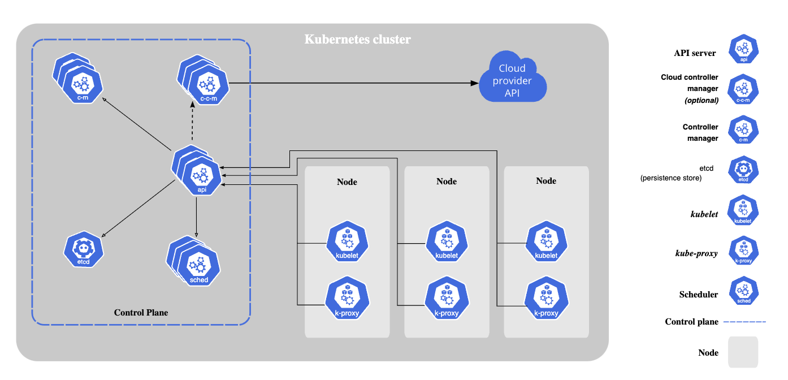

# Làm quen với Kubernetes - K8S
- 

## 1. Khởi động k8s
- Khởi động with K8s trên Docker Desktop
- minikube :
	- một dạng tạo cluser thông qua container docker
	- Hỗ trợ thêm giao diện quản lý kubernetes
	```
	minikube dashboard
	```
	- Xem config của k8s:
	```
	alias k='kubectl'  # mục đích tạo name viết tắt cho lênh
	k config view.    # thấy file config của nó
	kubectl cluster-info. # thấy thông tin của cluster 
	kubectl get nodes #lấy thông tin của node

	```
	```sh
	minikube delete  # xoá cả cluster 
	```
## 2. K8S Architechture 


## 3. Practice Hello-node
Hướng dẫn tạo 1 app (deployment) và expose nó
```
kubectl get get pods
kubectl create namespace dev 
kubectl get pods -n dev 

kubectl create deployment hello-node --image=k8s.gcr.io/echoserver:1.4
kubectl create deployment hello-node --image=k8s.gcr.io/echoserver:1.4 -n dev    # tao
kubectl get deployments --all-namespaces
kubectl get events -n dev
kubectl expose deployment hello-node --type=LoadBalancer --port=8080
kubectl get services
minikube service hello-node
//On cloud providers that support load balancers, an external IP address would be provisioned to access the Service. On minikube, the LoadBalancer type makes the Service accessible through the minikube service command.
```
## 4 Command with deployment
```
kubectl deploy -f v1.yaml	#tạo deploy with template
kubectl get pods			# 
kubectl get deployment   	 # lấy ra thông tin apps đã được deploy with k8s
kubectl describe
kubectl delete -f v1.yaml 	# delete with template deploy
```

## References
[!DevopsJourney](https://youtu.be/1Lu1F94exhU?si=4xuEPHS9Z0gm3c8F)


## Question
Q: Sao deploy với k8s cần lệnh 
```sh
minikube service mywebapp
```
Còn bên helm thì không?

=> A : Helm có sử dụng service và port-forward nhớ hem 

	```sh
	servicename=$(kubectl get service -l "app={{ .Values.appName }}" -o jsonpath="{.items[0].metadata.name}")
	kubectl --namespace {{ .Values.namespace}} port-forward service/{{ .Values.appName }} 8888:80
	```